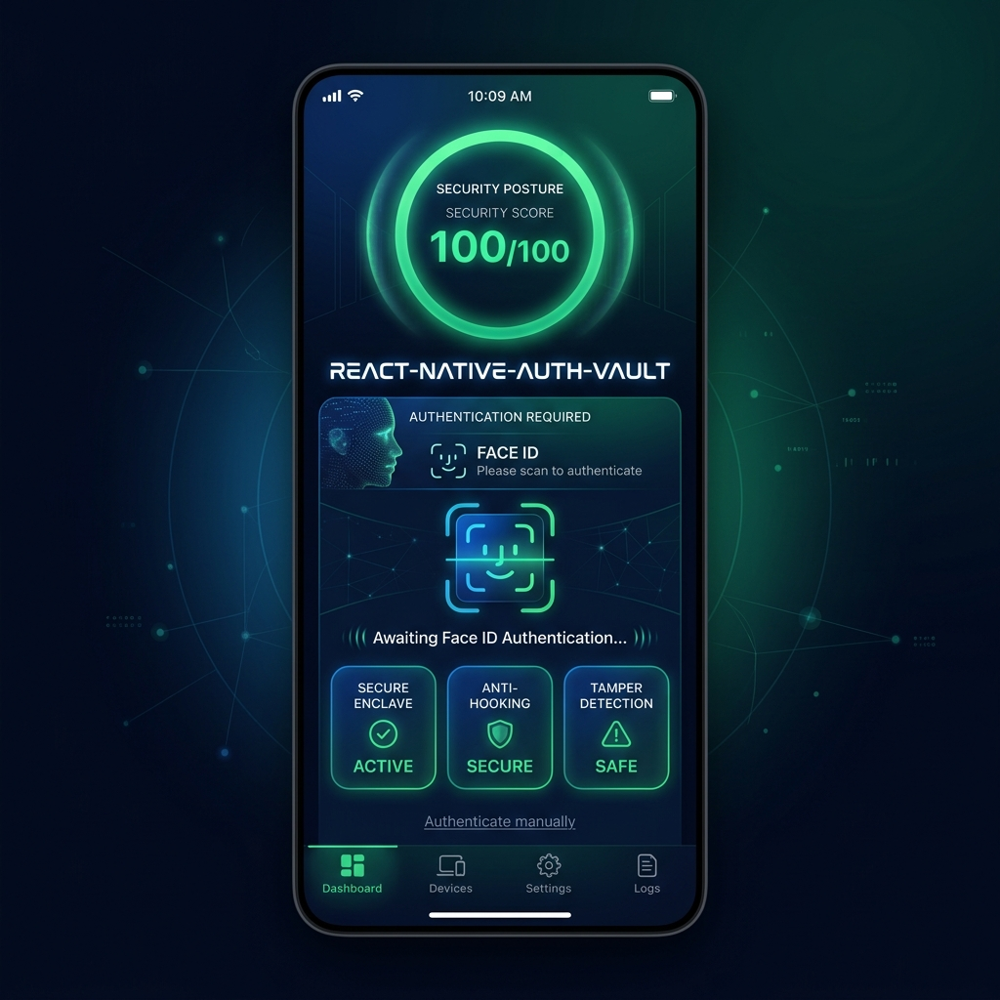

# 🛡️ react-native-auth-vault

[](https://www.npmjs.com/package/@hituchhimpa/react-native-auth-vault)
[](https://www.npmjs.com/package/@hituchhimpa/react-native-auth-vault)
[](https://github.com/HituChhimpa7/react-native-auth-vault-community)
[](https://github.com/HituChhimpa7/react-native-auth-vault-community)
[](LICENSE)
[](https://reactnative.dev)
[](https://reactnative.dev/docs/the-new-architecture/landing-page)
[](https://expo.dev)

> **The only React Native security toolkit that passes a bank's security audit out of the box.**

Replace 5+ separate security packages with a single, production-hardened SDK built on Apple Secure Enclave, Android StrongBox, and hardware security modules. 

`react-native-auth-vault` provides bank-grade biometric encryption, secure in-memory storage (never exposed to the JavaScript heap), runtime threat detection (debugger, hooking, tamper, emulator, and jailbreak/root), device attestation, and hardware-backed request signing.

<p align="center">
  
</p>

---

## 📊 Competitive Landscape

| Feature | `react-native-keychain` | `react-native-biometrics` | `react-native-encrypted-storage` | **react-native-auth-vault** |
|---|:---:|:---:|:---:|:---:|
| **Biometric Encryption** | ✅ | ✅ | ❌ | **✅ Yes** |
| **Hardware-Backed Keys** | Partial | ❌ | ❌ | **✅ Secure Enclave / StrongBox** |
| **Root & Jailbreak Detection** | ❌ | ❌ | ❌ | **✅ Built-in (Multi-layered)** |
| **Frida & Xposed Hooking Detection** | ❌ | ❌ | ❌ | **✅ Active Runtime Scan** |
| **App Tampering Detection** | ❌ | ❌ | ❌ | **✅ Code Signature Integrity** |
| **Device Attestation (Play Integrity / App Attest)** | ❌ | ❌ | ❌ | **✅ Nonce-based Cryptographic** |
| **Session Expiry & Auto-Lock** | ❌ | ❌ | ❌ | **✅ Native Timers** |
| **Privacy Screen (App Switcher Masking)** | ❌ | ❌ | ❌ | **✅ Auto Blur / FLAG_SECURE** |
| **Tapjacking / Overlay Protection** | ❌ | ❌ | ❌ | **✅ Yes (Android)** |
| **Secure In-Memory Storage** | ❌ | ❌ | ❌ | **✅ zero-fill, `mlock` page** |
| **Asymmetric ECC Signing** | ❌ | ❌ | ❌ | **✅ P-256 ECC Signatures** |
| **Real-time Security Events** | ❌ | ❌ | ❌ | **✅ Reactive Event Listener** |
| **Security Scoring Engine** | ❌ | ❌ | ❌ | **✅ Unified Audit Score** |
| **Expo Config Plugin** | ❌ | ❌ | ❌ | **✅ Plug-and-Play** |

---

## ✨ v1.1.0 Feature Highlights & Native Architecture

### 🔐 Hardware-Protected Vault & Encryption
AES-256 encryption backed by hardware-isolated cryptoprocessors.
- **iOS:** Keychain Services integration utilizing Access Control flags to gate keys with Face ID / Touch ID or Device Passcode.
- **Android:** AES-256 key generation inside `AndroidKeyStore` with dedicated **StrongBox** hardware support where available.

### 🕵️ Dynamic Threat Detection
Provides multi-layered system and runtime validation:
- **Jailbreak / Root Detection:** Scans for forbidden directories, writable files, system bin files (`su`, `busybox`), and mock location providers.
- **Frida / Xposed Injection:**
  - **iOS:** Inspects dyld images in memory for injected frameworks (`FridaGadget`, `cynject`, `libcycript`, `MobileSubstrate`).
  - **Android:** Parses `/proc/self/maps` at runtime to detect memory mappings of malicious binaries.
- **App Tamper Verification:**
  - **iOS:** Runs `SecStaticCodeCheckValidity` to verify code signature matches development keys.
  - **Android:** Extracts and compares the APK signing certificate hash against the expected original certificate.
- **Debugger Detection:** Monitors `sysctl` `P_TRACED` flag on iOS and `Debug.isDebuggerConnected()` on Android.

### 🧠 Secure In-Memory Storage
Variables stored in JavaScript heap can be easily dumped from memory or read by attackers. `auth-vault` provides native-level in-memory storage:
- **iOS:** Key-value pairs stored in memory pages locked using `mlock` to prevent them from writing to swap space.
- **Android:** Uses native `CharArray` buffers which can be manually zero-filled (`\u0000`) before garbage collection, rather than immutable Java strings.

### 📱 Privacy Screen & Tapjacking Defense
- **Privacy Screen:**
  - **iOS:** Automatically overlays a system `UIVisualEffectView` blur on application resignation (`UIApplicationWillResignActiveNotification`).
  - **Android:** Sets `FLAG_SECURE` on the window to natively block screenshots, video recordings, and app-switcher snapshots.
- **Tapjacking Protection:** Activates Android `filterTouchesWhenObscured` to drop touches whenever an overlay or overlay-based malware is running on top of your app.

### 📡 Real-Time Security Events
Emit instant react native events when threats or status changes occur (e.g. Session Expiration, Biometrics change, Frida hooking detection).

---

## 📦 Installation

```sh
npm install @hituchhimpa/react-native-auth-vault
# or
yarn add @hituchhimpa/react-native-auth-vault
```

**iOS — Link CocoaPods:**
```sh
cd ios && pod install
```

---

## ⚙️ Expo Setup

Add `@hituchhimpa/react-native-auth-vault` to your Expo config (`app.json` or `app.config.js`):

```json
{
  "expo": {
    "plugins": [
      [
        "@hituchhimpa/react-native-auth-vault",
        {
          "faceIDPermission": "Allow $(PRODUCT_NAME) to use Face ID for secure authentication."
        }
      ]
    ]
  }
}
```

Then regenerate native folders:
```sh
npx expo prebuild
```

---

## 📖 Complete API Reference

### Core Secure Storage

#### `AuthVault.setItem(key: string, value: string, prompt: string): Promise<boolean>`
Encrypts and saves a key-value pair.
- `key`: Unique identifier.
- `value`: Sensitive text to store.
- `prompt`: Message to display in the biometric dialog. **Pass an empty string (`""`) for silent hardware-backed storage (no prompt).**

#### `AuthVault.getItem(key: string, prompt: string): Promise<string | null>`
Retrieves and decrypts a key-value pair.
- `key`: Unique identifier.
- `prompt`: Biometric prompt message. **Pass `""` if retrieved silently (without prompt).**
- *Note:* Returns `null` if the item does not exist or user cancels the prompt.

#### `AuthVault.removeItem(key: string): Promise<boolean>`
Deletes a value and its encryption key from storage.

#### `AuthVault.encrypt(plainText: string, prompt: string): Promise<string>`
Encrypts arbitrary string data and returns a Base64-encoded encrypted string. Suitable for encrypting custom database entries.

#### `AuthVault.decrypt(encryptedBase64: string, prompt: string): Promise<string>`
Decrypts a Base64-encoded ciphertext string back to raw text.

---

### Security Auditing

#### `AuthVault.audit(): SecurityPosture`
Synchronously scans the device and returns a diagnostic object of the system's security integrity.

```typescript
const report = AuthVault.audit();
```

##### `SecurityPosture` properties:
- `securityScore`: `number` (0 to 100). Rating of device safety.
- `jailbroken`: `boolean` (iOS jailbreak detected).
- `rooted`: `boolean` (Android root detected).
- `emulator`: `boolean` (Running on simulator/emulator).
- `debuggerAttached`: `boolean` (Runtime debugger attached).
- `hookingDetected`: `boolean` (Frida/Xposed hooking detected).
- `appTampered`: `boolean` (App package altered/resigned).
- `biometricEnrollmentChanged`: `boolean` (Biometrics added/deleted since setup).
- `hardwareBacked`: `boolean` (Device hardware supports secure keys).
- `biometricEnabled`: `boolean` (User has enrolled biometrics).

---

### Device & UI Protection

#### `AuthVault.setPrivacyScreenEnabled(enabled: boolean): void`
Blocks screenshots/screen recordings on Android and applies a secure blur in the App Switcher on iOS.

#### `AuthVault.setOverlayProtectionEnabled(enabled: boolean): void`
*(Android Only)* Blocks touch events when the app is obscured by an overlay window (prevents Tapjacking).

#### `AuthVault.generateAttestation(nonce: string): Promise<string>`
Generates a platform integrity payload (App Attest on iOS / Play Integrity Token on Android) bound to the provided `nonce`.
- *Note:* The token must be validated cryptographically on your server.

---

### Hardware Signing & Keys

#### `AuthVault.generateSigningKeyPair(tag: string): Promise<string>`
Generates a P-256 ECC key pair inside hardware (Secure Enclave / StrongBox). Returns the Base64 DER/PEM encoded public key. The private key never leaves the hardware chip.

#### `AuthVault.signData(tag: string, data: string): Promise<string>`
Signs text data using the private key corresponding to `tag`. Returns a Base64 cryptographic ECDSA signature.

---

### Session & Memory Control

#### `AuthVault.setSessionTimeout(seconds: number): void`
Sets a timer duration (in seconds) for session validation.

#### `AuthVault.isSessionExpired(): boolean`
Returns `true` if the elapsed time since `setSessionTimeout` or the last authentication exceeds the timeout.

#### `AuthVault.wipeSession(): void`
Instantly locks the vault, clears session timestamps, and zeroes out all secure in-memory storage.

#### `AuthVault.secureStore(key: string, value: string): void`
Stores sensitive temporary data directly in native-isolated memory.

#### `AuthVault.secureRead(key: string): string | null`
Reads data from native-isolated memory.

#### `AuthVault.secureWipe(): void`
Zero-fills and clears all secure native-isolated memory storage.

---

### Key Rotation & Events

#### `AuthVault.rotateEncryptionKey(): Promise<boolean>`
Re-encrypts the master storage key with a newly generated hardware key. Use this periodically to implement security compliance policies.

#### `AuthVault.onSecurityEvent(callback: (event: SecurityEvent) => void): EmitterSubscription`
Listens for real-time security events.

##### `SecurityEvent` Type:
```typescript
interface SecurityEvent {
  type: 'SESSION_EXPIRED' | 'BIOMETRIC_CHANGED' | 'HOOKING_DETECTED' | 'APP_TAMPERED';
  detail?: string;
  timestamp: number;
}
```

---

## 🚀 Quick Start & Integration Guides

### 1. Unified Device Risk Check
Implement this in your App entry point or prior to starting high-risk actions (e.g. transfers, password updates):

```typescript
import { Alert, BackHandler } from 'react-native';
import { AuthVault } from '@hituchhimpa/react-native-auth-vault';

function checkDeviceTrust() {
  const security = AuthVault.audit();

  if (security.jailbroken || security.rooted || security.hookingDetected) {
    Alert.alert(
      'Security Exception',
      'This device has been compromised. The app will close.',
      [{ text: 'OK', onPress: () => BackHandler.exitApp() }]
    );
    return false;
  }

  if (security.securityScore < 80) {
    Alert.alert('Warning', 'Your device does not meet optimal security requirements.');
  }
  
  return true;
}
```

### 2. Biometric-Authenticated API Handshake
Request cryptographic signing keys on enrollment and sign critical request payloads:

```typescript
import { AuthVault } from '@hituchhimpa/react-native-auth-vault';

// 1. Setup Phase (Device Registration)
async function registerDevice() {
  const publicKey = await AuthVault.generateSigningKeyPair('app-signing-key');
  await sendPublicKeyToBackend(publicKey);
}

// 2. Transaction Phase (Request Signing)
async function makeSecureTransaction(amount: number, recipientId: string) {
  const payload = JSON.stringify({ amount, recipientId, timestamp: Date.now() });
  
  // Prompt user for biometrics & sign payload inside hardware
  const signature = await AuthVault.signData('app-signing-key', payload);
  
  const response = await fetch('https://api.yourbank.com/transfer', {
    method: 'POST',
    headers: {
      'Content-Type': 'application/json',
      'X-Device-Signature': signature,
    },
    body: payload,
  });
  
  return response.json();
}
```

### 3. Session Expiration & Screen Masking
Handle privacy overlays and session auto-lock reactively:

```typescript
import React, { useEffect } from 'react';
import { AuthVault } from '@hituchhimpa/react-native-auth-vault';

export function App() {
  useEffect(() => {
    // Enable system switcher masking & screenshot protection
    AuthVault.setPrivacyScreenEnabled(true);
    AuthVault.setOverlayProtectionEnabled(true);

    // Set 3-minute inactivity session lock
    AuthVault.setSessionTimeout(180);

    // Register listener for real-time security events
    const subscription = AuthVault.onSecurityEvent((event) => {
      if (event.type === 'SESSION_EXPIRED') {
        // Clear local credentials, wipe memory, and route to login
        AuthVault.wipeSession();
        navigateToLogin();
      }
      if (event.type === 'BIOMETRIC_CHANGED') {
        handleBiometricAlteration();
      }
    });

    return () => {
      subscription.remove();
    };
  }, []);

  return <MainNavigator />;
}
```

---

## 🔒 Security Advisories & Vulnerability Reporting

If you believe you have discovered a security vulnerability or bug in this library, you can:
- 🐛 Open a public issue on our [GitHub Issues](https://github.com/HituChhimpa7/react-native-auth-vault-community/issues) page.
- ✉️ Contact us privately via email: `hituchhimpa7@users.noreply.github.com`.

Please include a detailed description of the vulnerability/bug, steps to reproduce it, and the potential impact. We will acknowledge and address verified reports as soon as possible.

---

## 🗺️ Roadmap

| Version | Target / Status | Features |
|---|---|---|
| **v1.1.0** | ✅ Released | Biometric enrollment change detection, Session expiry, ECC key pairs + signing, Secure memory, Tamper detection, Security events API, Key rotation, Device attestation, Privacy screen, Tapjacking protection, Expo plugin |
| **v1.2.0** | 🗓️ Next Release | SSL/Certificate Pinning helper, Real-time screen recording detection, Clipboard auto-clear protection, Unified `getSecurityPosture()` API, Secure CSPRNG |
| **v1.3.0** | 🗓️ Future Release | TOTP engine (RFC 6238), Network anomaly detection (VPN/Proxy/Tor), Anti-debugging active policy, Panic wipe API |
| **v1.4.0** | 🗓️ Long-term | BIP-39 mnemonic generation (native), BIP-32 HD key derivation, Zero-knowledge proof module, Quantum-safe key exchange |

---

## 🤝 Contributing

Contributions, issues, and feature requests are welcome! Feel free to check the [issues page](https://github.com/HituChhimpa7/react-native-auth-vault-community/issues).

Before submitting code, please review the [Contributing Guide](CONTRIBUTING.md) and the [Code of Conduct](CODE_OF_CONDUCT.md).

---

## 📄 License

MIT — See [LICENSE](LICENSE) for details.

---

<p align="center">
  <strong>react-native-auth-vault</strong><br/>
  Bank-grade security for every React Native developer.<br/>
  Made with ❤️ by <a href="https://github.com/HituChhimpa7">Hitesh Chhimpa</a>
</p>
